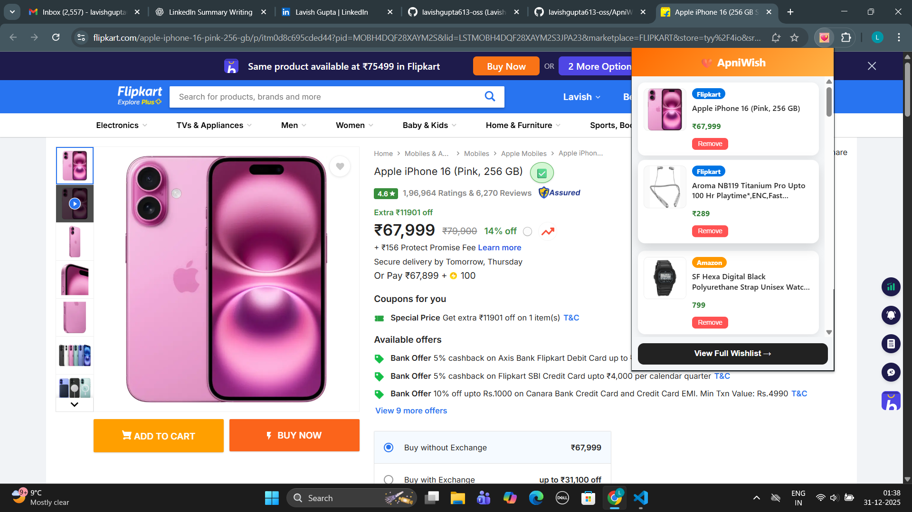
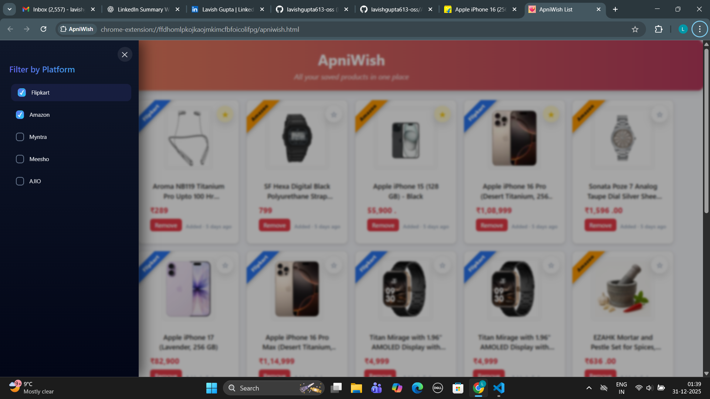

# 🛍️ ApniWish – Universal Wishlist Browser Extension


**ApniWish** is a smart browser extension that lets you save products from multiple e-commerce platforms into **one unified wishlist**.  
No more switching between Amazon, Flipkart, Meesho, Ajio, or Myntra — everything you want to buy is managed in **one place**.

---

## 🚀 Supported Platforms

- Amazon  
- Flipkart  
- Meesho  
- Ajio  
- Myntra  

---

## ✨ How ApniWish Works

1. Visit a product page on any supported platform  
2. You’ll see an **🔖 button** near the product title  
3. Click the button to save the product  
4. Open the ApniWish extension popup to view saved products  
5. Click **“View Full Wishlist”** to open a full wishlist page  

🎯 Result: All your desired products from multiple platforms, **organized and accessible in one place**

---

## 🧩 Key Features

- ➕ **One-click product save** from product pages  
- 🧾 **Centralized wishlist** across multiple platforms  
- 🖼️ Displays **product image, title, platform name, and added time**  
- 🏷️ **Platform-based filtering**
  - View only Amazon products  
  - Only Flipkart  
  - Any combination or all platforms  
- ⚡ Fast, clean, and minimal UI  
- 🧠 Designed for users who compare and plan purchases  

---

## 📸 Screenshots

### ➕ Add Product from Product Page


### 🧾 Extension Popup


### 📄 Full Wishlist Page


### 🔍 Platform Filter



## 🛠 Tech Stack

- **HTML**
- **CSS**
- **JavaScript**
- **Chrome Extension APIs**

---

## 📂 Project Structure

```text
ApniWish/
│── assets/
│   ├── demo.gif
│   ├── add-button.png
│   ├── popup.png
│   ├── wishlist-page.png
│   └── filter.png
│── manifest.json
│── background.js
│── content.js
│── apniwish.html
│── apniwish.css
│── apniwish.js
│── popup.html
│── popup.css
│── popup.js
│── style.css
│── icon/
│── README.md

```

## ⬇️ Download & Installation

Follow these steps to install **ApniWish** locally in Chrome:

### Step 1: Download the Extension
- Go to the GitHub repository
- Click on **Code**
- Select **Download ZIP**
- Extract the ZIP file on your system

### Step 2: Open Chrome Extensions Page
- Open Google Chrome
- Go to: chrome://extensions/

### Step 3: Enable Developer Mode
- Turn ON **Developer Mode** (top-right corner)

### Step 4: Load the Extension
- Click on **Load unpacked**
- Select the extracted **ApniWish** folder

✅ ApniWish will now appear in your Chrome extensions list

---

### Step 5: Use ApniWish
- Open any product page on **Amazon, Flipkart, Meesho, Ajio, or Myntra**
- Click **Add to ApniWish** near the product title
- Open the extension to view your saved products


## 🔮 Upcoming Features & Enhancements

ApniWish is actively evolving to provide a smoother and more powerful wishlist experience.  
Below are the planned upgrades currently in progress:

### 🚀 Browser Expansion
- **Microsoft Edge support** is coming soon  
  - The extension is currently **under review** on the Microsoft Edge Add-ons Store  
  - It will be available for Edge users shortly after approval

### ☁️ Cloud & Sync
- Cloud-based synchronization to access your wishlist across multiple devices
- Secure storage for saved products

### 🔔 Smart Notifications
- Price drop alerts for saved products
- Notifications for discounts and offers

### ❤️ Wishlist Enhancements
- Favorite and priority marking for important products
- Improved sorting and filtering options
- Multiple wishlists for different categories (e.g., Electronics, Fashion)

### 🌙 UI & Experience
- Dark mode support
- Improved UI animations and performance
- Better mobile and tablet compatibility

### 📦 Platform Expansion
- Support for more e-commerce platforms in future updates
- Enhanced product detection accuracy

---

> ✨ These updates aim to make ApniWish a complete, cross-platform wishlist solution for smarter online shopping.

